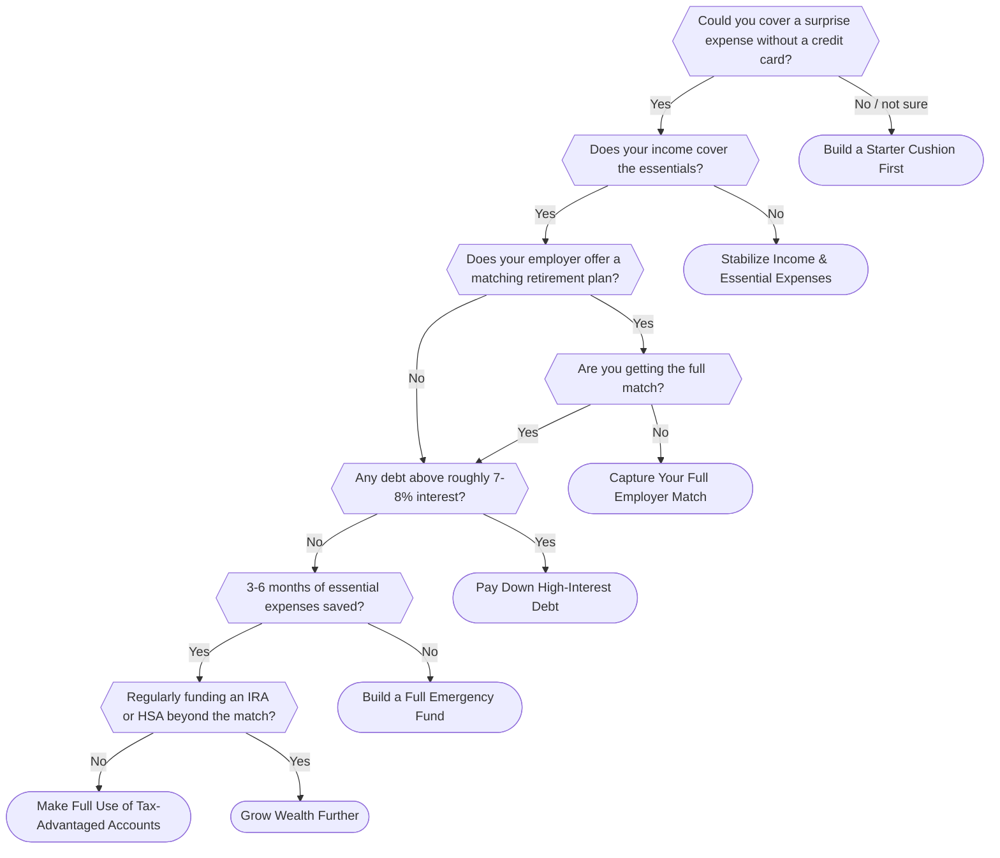

# Money Priorities Quiz

A short, branching flowchart quiz that tells you what to focus on next with your money, and why, instead of pointing you at another long article. Answer a handful of yes/no questions about your situation (do you have a cushion for a surprise expense, are you capturing your full employer 401(k) match, do you have high-interest debt, and so on) and land on a single, clear result page with a recommendation and the reasoning behind it.

The question order and priorities are adapted from ideas widely discussed in personal finance communities like r/personalfinance, rewritten in original wording, not copied text or imagery.

## Why this exists

Personal finance education is everywhere, but most of it assumes you have time to read a book or dig through a wiki. This is a low-friction alternative: no account, no data entry beyond your quiz answers, no numeric calculators, just a quick path to "here's your priority right now."

## The full flow

Every question and every possible outcome, in one diagram. This mirrors `lib/flowchart/data.ts` exactly — if you edit that file, update this diagram too.



## Stack

- [Next.js](https://nextjs.org/) 16 (App Router) + TypeScript
- Tailwind CSS
- Built as a static export (`output: 'export'`), no backend server required

## Project structure

- `lib/flowchart/data.ts` — all quiz content lives here (questions, options, results, "not sure how to answer?" guidance, and each result's "if this still feels unclear" note and "Learn more" reading list). Editing or extending the quiz means editing this file only, no component changes needed.
- `lib/flowchart/engine.ts` / `types.ts` — the data model and small helpers (`getNode`, `isResultNode`, etc.)
- `app/quiz` — the interactive quiz flow (client-side state via `useReducer`)
- `app/result/[resultId]` — statically generated result pages, one per outcome
- `scripts/validate-flowchart.ts` — a graph-integrity check (every branch resolves, every result is reachable) that runs automatically before every build

## Development

```bash
npm install
npm run dev
```

Open [http://localhost:3000](http://localhost:3000).

## Other scripts

- `npm run validate` — check the flowchart data for broken or unreachable branches
- `npm run build` — production build (runs `validate` first, then a static export to `out/`)
- `npm run lint` — ESLint

## Disclaimer

This quiz gives a general starting point, not a full financial plan or personalized financial advice.
